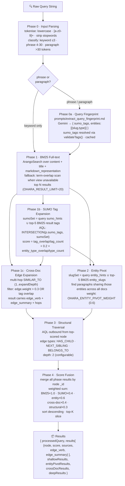

# Doc Ohara: Space-Time Graph for Advanced Context Retrieval

Doc Ohara is a document transformation and retrieval engine that converts unstructured documents into a multi-dimensional **Space-Time Graph** stored in ArangoDB. It solves the "lost in the middle" problem of traditional flat-chunk RAG by navigating a structured graph instead of scanning a flat list.

> **TL;DR**: Doc Ohara parses documents into a hierarchy of sections and paragraphs, enriches each node with SUMO ontology tags and named entities, links shared concepts across documents, and retrieves context through a three-phase hybrid engine.

---

## Architecture Overview

```mermaid
flowchart TD
    SRC["📄 PDF / EPUB / DOCX / MD"]

    subgraph INGEST["① Ingest Pipeline  —  src/ingest/pipeline.js"]
        direction TB
        I1["Preflight\nvalidate API keys + lit CLI"]
        I2["Dedup\nSHA-256 hash → skip if seen"]
        I3["Parse\nLiteParse → Markdown chunks"]
        I4["LLM Structuring\nGemini → DoCO nodes\n(Chapter / Section / Paragraph / Table…)"]
        I5["SUMO Validation\n22,700-entry ontology index\nexact → insensitive → alias"]
        I6["Entity Extraction\nPERSON / ORG / TECH / CONCEPT…\ncanonical dedup"]
        I7["Collection Transform\nnormalise + artifact filter\n+ fragment reattach"]
        I8["Persist to ArangoDB\nHAS_CHILD · NEXT_SIBLING\nBELONGS_TO · MENTIONS · RELATED_TO"]
        I9["Document Rollup\nunion entity_slugs + sumo_tags\nonto document node"]
        I10["Cross-Doc Similarity\nJaccard on entity sets\n→ SIMILAR_TO edges"]
        I11["Edge Enrichment\nGemini → verb + tags + summary\non each SIMILAR_TO edge"]
        I1-->I2-->I3-->I4-->I5-->I6-->I7-->I8-->I9-->I10-->I11
    end

    subgraph DB["ArangoDB Space-Time Graph"]
        direction LR
        C1[documents]
        C2[sections]
        C3[paragraphs]
        C4[tables]
        C5[entities]
        C6[edges]
    end

    subgraph RETRIEVE["② Retrieval Engine  —  src/retrieval.js"]
        direction TB
        R0["Phase 0 · Input Parsing\ntokenise · classify\nkeyword / phrase / paragraph"]
        R0a["Phase 0a · Query Fingerprint\nGemini → sumo_tags + entity hints\n(fires for phrase + paragraph queries)"]
        R1["Phase 1 · BM25 Full-text\nArangoSearch over content + title"]
        R2["Phase 1b · SUMO Expansion\ntag overlap + entity-type affinity\nscore = tag_overlap + 0.2×type_overlap"]
        R3a["Phase 1c · Cross-Doc Edges\nfollow SIMILAR_TO from seed docs\nfilter by weight > 0.3 or tag overlap"]
        R3b["Phase 2 · Entity Pivot\nshared entity_slugs across all docs\ndamped by OHARA_ENTITY_PIVOT_WEIGHT"]
        R4["Phase 3 · Structural Traversal\nAQL graph outbound from top node\nHAS_CHILD · NEXT_SIBLING · BELONGS_TO"]
        R5["Phase 4 · Score Fusion\nweighted sum · dedup by _id\nsort descending"]

        R0-->R0a-->R1-->R2
        R2-->R3a & R3b
        R3a & R3b-->R4-->R5
    end

    OUT["🔍 Ranked results\n{ node, score, sources, edge_verb, edge_summary }"]
    WIKI["📚 Quartz / Obsidian wiki export\nsrc/exporter.js"]

    SRC --> INGEST --> DB
    DB --> RETRIEVE --> OUT
    DB --> WIKI
```



---

## The Space-Time Graph

### Collections

| Collection | Contents |
|---|---|
| `documents` | Metadata root: source file, parser, title, upload time, entity_slugs, sumo_tags, published_date, temporal_coverage, temporal_granularity, temporal_confidence, decay_class, effective_decay_class, similar_to_indegree |
| `sections` | Structural hierarchy: chapter, section, subsection with level and title |
| `paragraphs` | Content nodes: body text, figures, list items with sumo_tags, entity_slugs, entity_types |
| `tables` | 2-D matrix data with markdown representation |
| `entities` | Named entities: canonical name, type, aliases, description, document_ids |
| `edges` | All relations (single collection, typed by `relation` field) |

### Edge Types

| Relation | Direction | Meaning |
|---|---|---|
| `HAS_CHILD` | section → section / paragraph / table | Structural parent–child |
| `NEXT_SIBLING` | section → section | Sequential ordering |
| `BELONGS_TO` | paragraph / table → document | Ownership |
| `MENTIONS` | paragraph → entity | Named entity occurrence |
| `RELATED_TO` | entity ↔ entity | Co-occurrence in the same paragraph |
| `SIMILAR_TO` | document → document | Jaccard similarity of entity sets (threshold-gated); enriched with LLM-generated `verb`, `tags`, `summary` |
| `TOC_REF` | document → section | TOC entry resolved to a section node (matched by page number then title) |

---

## Ingest Pipeline

```mermaid
flowchart TD
    FILE["📄 Input File\nPDF · EPUB · DOCX · MD"]

    FILE --> PRE

    PRE["① Preflight\nCheck GEMINI_API_KEY · ARANGO_URL · lit CLI"]
    PRE --> DEDUP

    DEDUP{"② Dedup\nSHA-256 hash\nalready ingested?"}
    DEDUP -- "yes (no --force)" --> SKIP["⏭ Skip"]
    DEDUP -- "no / --force" --> PARSE

    PARSE["③ Parse\nLiteParse → Markdown\n.md files pass through directly"]
    PARSE --> CHUNK

    CHUNK["Chunk\nMarkdown chunker\nsplit by heading / size"]
    CHUNK --> LLM

    LLM["④ LLM Structuring\nGemini gemini-2.5-flash-lite · Flex Inference\nparallel batches (OHARA_INGEST_CONCURRENCY=4)\noutput: DoCO nodes\nChapter · Section · Paragraph · Table · Figure…\n— cached by content hash —"]
    LLM --> SUMO

    SUMO["⑤ SUMO Tag Validation  src/sumo.js\n22,700-entry ontology index\n1. exact match\n2. case + separator-insensitive\n3. alias table (~100 entries)\ninvalid tags dropped + logged"]
    SUMO --> ENT

    ENT["⑥ Entity Extraction  src/entities.js\nvalidate candidate_entities from LLM\nPERSON · ORG · LOCATION · DATE\nTECH · AMOUNT · EVENT · CONCEPT\ncanonical dedup within node\nbuild entity_slugs + entity_types arrays"]
    ENT --> XFORM

    XFORM["⑦ Collection Transform\nnormalise → documents · sections · paragraphs · tables\nartifact filter: remove separator lines + TOC noise + short nodes\nfragment reattach: merge orphaned short paragraphs"]
    XFORM --> PERSIST

    PERSIST["⑧ Persist to ArangoDB  src/db/client.js\ninsert nodes into collections\nstructural edges:\nHAS_CHILD · NEXT_SIBLING · BELONGS_TO\nsemantic edges:\nMENTIONS · RELATED_TO"]
    PERSIST --> ROLLUP

    ROLLUP["⑨ Document Rollup\nunion all paragraph entity_slugs + sumo_tags\nonto the document root node\nenables O(docs) pre-filtering at query time"]
    ROLLUP --> SIM

    SIM["⑩ Cross-Doc Similarity\nJaccard similarity of entity sets\nvs. all existing documents\ncreate SIMILAR_TO edge if ≥ OHARA_SIMILARITY_THRESHOLD (0.1)"]
    SIM --> ENRICH

    ENRICH["⑪ Edge Enrichment\nfor each new SIMILAR_TO edge:\nGemini → verb · tags · summary (≤60 words)\ncached · stored on edge\nprompt: prompts/enrich_cross_doc_edge.md"]

    ENRICH --> DONE["✅ Document ingested\nready for retrieval"]
```



### Stages (`src/ingest/pipeline.js`)

1. **Preflight** — validates `GEMINI_API_KEY`, `ARANGO_URL`, and the `lit` CLI (LiteParse).
2. **Dedup** — SHA-256 hashes the file; skips if already ingested (override with `--force`).
3. **Parsing** — LiteParse converts PDF/EPUB/DOCX to Markdown; plain `.md` files pass through directly.
4. **LLM structuring** — Gemini (`gemini-2.5-flash-lite`, Flex Inference) maps Markdown chunks to DoCO nodes (`Chapter`, `Section`, `Paragraph`, `Table`, `Figure`, `Authors`, `Bibliography`, …). Responses are cached by content hash. Parallel batches (default 4, `OHARA_INGEST_CONCURRENCY`).
5. **SUMO tag validation** — resolves `sumo_candidate_tags` against the SUMO ontology index (22,700 entries). Three-stage resolution: exact match → case/separator-insensitive → alias table. Duplicates collapsed. Invalid tags logged and dropped.
6. **Entity extraction** — validates `candidate_entities` from the LLM. Supported types: `PERSON`, `ORG`, `LOCATION`, `DATE`, `TECH`, `AMOUNT`, `EVENT`, `CONCEPT`. Canonical deduplication within each node.
7. **Collection transform** — normalizes nodes into `documents`, `sections`, `paragraphs`, `tables`. Artifact filter removes separator lines, TOC noise, and very short nodes. Fragment reattachment merges orphaned short paragraphs.
8. **Persistence** — inserts into ArangoDB with `HAS_CHILD`, `NEXT_SIBLING`, `BELONGS_TO` structural edges; upserts entity nodes and inserts `MENTIONS` / `RELATED_TO` edges.
9. **Document rollup** — after all paragraphs are inserted, unions `entity_slugs` and `sumo_tags` onto the `documents` record for O(docs) pre-filtering.
10. **Cross-document similarity** — computes Jaccard similarity between the new document's entity set and all existing documents. Creates `SIMILAR_TO` edges where similarity ≥ `OHARA_SIMILARITY_THRESHOLD` (default 0.1).
11. **Cross-document edge enrichment** — for each new `SIMILAR_TO` edge, calls Gemini (Flex Inference, cached) with representative snippets from both documents to generate a `verb` (e.g. `"extends the argument of"`), `tags` (1–4 SUMO-style concept tags), and `summary` (≤ 60 words). Result is stored on the edge for use at retrieval time. Prompt: `prompts/enrich_cross_doc_edge.md`. A `temporal_relation` field (`extends` | `supersedes` | `discusses`) is also set on the edge from the verb — no extra LLM call. After all `SIMILAR_TO` edges are created, `similar_to_indegree` is computed for the new document; if it exceeds `OHARA_SIMILAR_TO_EVERGREEN_THRESHOLD`, `effective_decay_class` is promoted to `EVERGREEN`.

### Prompt Schema (`prompts/ingest_document.md`)

The Gemini prompt instructs the model to output `{ nodes: [...] }` where each node carries:

```
type              # DoCO type (Chapter, Section, Paragraph, Table, Figure, …)
part              # front_matter | body_matter | back_matter
metadata          # { page, level }
sumo_candidate_tags   # short SUMO local names e.g. ["Agent", "Transaction"]
candidate_entities    # [{ name, canonical, type, aliases? }]
content / title / table / figure / agents_group / references   # type-specific fields

# document-level temporal fields (extracted once per doc, not per chunk):
published_date        # "YYYY-MM-DD" | "YYYY" | null
temporal_coverage     # { start: "YYYY"|null, end: "YYYY"|null }
temporal_granularity  # 'day'|'month'|'year'|'decade'|'century'
temporal_confidence   # 0.0–1.0
decay_class           # 'EVERGREEN'|'SCHOLARLY'|'CURRENT'|'EPHEMERAL'
```

---

## Retrieval Engine (`src/retrieval.js`)



Four sequential phases via `RetrievalEngine.query(rawInput, options)`:

### Phase 0 — Input Parsing
Tokenizes raw input: lowercase, `[a-z0-9]+` regex, strips stopwords, drops tokens ≤ 2 chars. Returns `{ keywords, raw }`.

### Phase 1 — Shallow Context
ArangoSearch BM25 full-text search over `content`, `title`, and `markdown_representation`. Returns top N results (default 20). Falls back to term-overlap scoring when the ArangoSearch view is unavailable.

### Phase 1b — SUMO Tag Expansion
Finds paragraphs whose `sumo_tags` overlap with the query's SUMO hints or the top BM25 results' tags. For phrase and paragraph queries (≥ 4 tokens), SUMO hints and entity types are extracted from the raw query via Gemini (`prompts/extract_query_fingerprint.md`) before this phase runs. The fingerprint also returns `temporal_intent` (`current_state` | `historical_fact` | `influence_chain` | `none`) which gates temporal scoring. Score = `tag_overlap / query_tag_count + 0.2 × entity_type_overlap / query_entity_type_count`.

### Phase 1c — Cross-Document Edge Expansion
Follows `SIMILAR_TO` edges from the seed documents (top 5 BM25 hits) to retrieve related paragraphs from other documents, up to `expandDepth` hops (graph traversal, `1..expandDepth ANY` over `SIMILAR_TO` edges). Edges are filtered by `weight > 0.3` or overlapping `edge.tags`. Each result carries `edge_verb`/`edge_summary` from the closest hop's ingest-time LLM enrichment, plus `hops` indicating how many SIMILAR_TO edges were traversed to reach it. Runs in parallel with Phase 3. Controlled by `OHARA_CROSS_DOC_WEIGHT` (default 0.4), `OHARA_CROSS_DOC_LIMIT` (default 5), and `OHARA_CROSS_DOC_EXPAND_DEPTH` (default 1). All three can be overridden per call via `query(text, { crossDocWeight, crossDocLimit, expandDepth })`.

### Phase 2 (formerly 1b) — Entity Pivot
From the top seed paragraphs' `entity_slugs`, finds other paragraphs across all documents that share those entities. Scores with a damped weight (`OHARA_ENTITY_PIVOT_WEIGHT`, default 0.6). Runs in parallel with Phase 1c. Entity hints carry `{ slug, type }` objects; paragraph nodes store a parallel `entity_types` array (built alongside `entity_slugs` at ingest time) to enable type-affinity scoring in Phase 1b without extra AQL joins. Old paragraphs without `entity_types` score 0 on type-affinity — backward-compatible.

### Phase 3 — Structural Traversal
AQL graph traversal outbound from the top-scored node via `HAS_CHILD`, `NEXT_SIBLING`, `BELONGS_TO` edge types. Depth defaults to 2.

### Phase 4 — Score Fusion
All phase results are merged by node `_id`. Scores are weighted and summed; results sorted descending. Cross-doc results propagate `edge_verb`/`edge_summary` to the fused entry. A temporal score is added per node when `temporal_intent ≠ 'none'`, using an exponential decay formula: `OHARA_TEMPORAL_WEIGHT × exp(−λ × Δt)`. λ is drawn from the document's `effective_decay_class` env var. The temporal contribution is skipped for `principal`-tier nodes and nodes whose BM25 score exceeds `OHARA_TEMPORAL_GATE_FLOOR` (protects high-relevance docs from recency bias).

Returns `{ processedQuery, results, tiers, shallowResults, entityPivotResults, crossDocResults, deepResults }`.

### Tier Classification — Principal / Integrity / Explorer

Inspired by how people actually research: [Bates' Berrypicking model](https://en.wikipedia.org/wiki/Berrypicking) (info-seeking is incremental, bit-by-bit), [Pirolli's Information Foraging Theory](https://en.wikipedia.org/wiki/Information_foraging) (follow "scent" signals, stop when scent weakens), and journalistic cross-referencing (a claim counts as verified only once corroborated by ≥2 independent sources). `query()`'s `tiers` field classifies the fused result set into three groups, computed by `_classifyTiers` (post-processing, no extra DB pipeline):

- **`tiers.principal`** — compact, corroborated-by-many-angles core answer. A node qualifies if it's hit by ≥2 phases (`contributions.length >= 2`) AND either spans ≥2 distinct documents or was reached via a cross-doc edge, AND its score clears a percentile floor (`OHARA_PRINCIPAL_SCORE_PCTL`, default top quartile). Capped at `OHARA_PRINCIPAL_LIMIT` (default 5).
- **`tiers.integrity`** — Principal plus "verified" entries: structural-traversal neighbors of Principal nodes, and cross-doc edges with `weight >= OHARA_INTEGRITY_WEIGHT_MIN` (default 0.6). Each entry carries a `provenance` array (phase, document, edge verb/hops) showing what corroborated it. An optional one-shot Gemini cross-check (`OHARA_INTEGRITY_LLM_VERIFY`, off by default) can further validate multi-document candidates — always called with `temperature: 0` and a single-turn prompt (no chat history), matching the existing `prompts/enrich_cross_doc_edge.md` call pattern.
- **`tiers.explorer`** — a `frontier` of further candidates one hop beyond Integrity (reuses `_phase1cCrossDocEdge` with `expandDepth + 1`), restricted to the band between `OHARA_EXPLORER_STOP_WEIGHT` (default 0.15) and `OHARA_INTEGRITY_WEIGHT_MIN` — the "weakening scent" zone. Returns metadata only (`document_id`, `edge_verb`, `edge_summary`, `score`), not full content — meant as candidate directions for a caller/UI to offer, not a final answer. No interactive multi-turn loop is wired up yet; `stopped_reason` explains why expansion stopped.

CLI: `node bin/ohara.js query "<text>" --tiers [--verbose]`.

---

## Entity System (`src/entities.js`)

Named entities are first-class graph nodes, not just tags on paragraphs.

**Entity types**: `PERSON`, `ORG`, `LOCATION`, `DATE`, `TECH`, `AMOUNT`, `EVENT`, `CONCEPT`

**Entity record**:
```json
{
  "_key": "bitcoin",
  "name": "Bitcoin",
  "slug": "bitcoin",
  "norm_key": "bitcoin",
  "type": "TECH",
  "aliases": ["BTC", "₿"],
  "description": "Decentralized digital currency…",
  "document_ids": ["doc/abc123", "doc/def456"],
  "mention_count": 47,
  "first_seen": "2026-06-23T…"
}
```

**Cross-document dedup**: run `node src/ingest/entity_dedup.js` after batch ingest to merge entity nodes with matching `norm_key`, repointing all `MENTIONS` edges to the surviving canonical node.

**Noise filtering**: `validateEntity` rejects opaque, machine-generated identifier tokens (hashes, UUIDs, addresses, base58/base64-ish strings) via `isOpaqueToken()` — a domain-agnostic heuristic (length, whitespace, vowel ratio), not specific to any one document type. This runs at ingest time on new documents. For already-ingested data, run `node scripts/clean_noise_entities.js --dry-run` to preview, then without `--dry-run` to remove noise entities, their edges, and strip matching slugs from `paragraphs`/`documents` `entity_slugs` rollups (requires a real ArangoDB connection, same as `entity_dedup.js`).

---

## SUMO Ontology Tags (`src/sumo.js`)

Every node is tagged with concepts from the [SUMO ontology](https://www.ontologyportal.org/) (22,700 entries in `ontology/sumo_index.json`).

Resolution order per tag:
1. Exact match against `sumo_index.json`
2. Case + separator-insensitive match
3. Alias table (~50 common LLM-emitted terms → canonical SUMO names)

Tags that fail all three stages are dropped and logged. Duplicate canonical tags within a node are collapsed.

---

## Wiki Export (`src/exporter.js`)

`QuartzExporter` converts the ArangoDB graph into a Quartz-compatible Markdown wiki.

```bash
npm run ohara:export          # Quartz Markdown → wiki/
npm run ohara:export:json     # Raw JSON → doc_pipeline/collections/export.json
```

Output structure:
```
wiki/
  index.md                    # Home page with document list and entity index link
  documents/
    <doc-slug>/
      index.md                # Document landing page with TOC
      <section-slug>.md       # One page per section with content + related links
  entities/
    index.md                  # Entity index grouped by type
    <entity-slug>.md          # Per-entity page: description + backlinks + related entities
```

Entity pages include:
- YAML frontmatter with `title`, `tags`, `aliases`
- LLM-generated stub description (filled during ingest)
- **Mentioned in** — every paragraph that mentions the entity with document/section context
- **Related Entities** — entities co-occurring in the same paragraphs

---

## Configuration

All tunables are set via environment variables. Copy `.env.example` to `.env`:

| Variable | Default | Purpose |
|---|---|---|
| `GEMINI_API_KEY` | — | Required. Google Gemini API key |
| `ARANGO_URL` | — | ArangoDB connection URL (may include credentials and DB name) |
| `ARANGO_USER` | — | DB username (can also embed in URL) |
| `ARANGO_PASSWORD` | — | DB password |
| `LITEPARSE_CLI_PATH` | — | Path to the `lit` LiteParse CLI binary |
| `PORT` | `3000` | HTTP server port |
| `OHARA_INGEST_CONCURRENCY` | `4` | Parallel LLM chunk requests during ingest |
| `OHARA_LLM_CACHE_DIR` | — | Directory for LLM response cache |
| `OHARA_SIMILARITY_THRESHOLD` | `0.1` | Min Jaccard score to create a `SIMILAR_TO` doc–doc edge |
| `OHARA_ENTITY_PIVOT_LIMIT` | `5` | Max cross-document paragraphs from entity-pivot phase |
| `OHARA_ENTITY_PIVOT_WEIGHT` | `0.6` | Score multiplier for entity-pivot results |
| `OHARA_CROSS_DOC_WEIGHT` | `0.4` | Score multiplier for cross-document edge expansion results |
| `OHARA_CROSS_DOC_LIMIT` | `5` | Max paragraphs returned per cross-document edge expansion |
| `OHARA_CROSS_DOC_EXPAND_DEPTH` | `1` | Max SIMILAR_TO hops to traverse from seed documents during Phase 1c |
| `OHARA_PRINCIPAL_SCORE_PCTL` | `0.75` | Score percentile floor (within fused results) for the Principal tier |
| `OHARA_PRINCIPAL_LIMIT` | `5` | Max entries in the Principal tier |
| `OHARA_INTEGRITY_WEIGHT_MIN` | `0.6` | Min cross-doc edge weight to count as "verified" in the Integrity tier |
| `OHARA_INTEGRITY_LLM_VERIFY` | off | Enable optional one-shot Gemini cross-check for Integrity-tier candidates (temperature 0) |
| `OHARA_EXPLORER_STOP_WEIGHT` | `0.15` | Min edge weight for a candidate to appear in the Explorer frontier (below this, scent too weak) |
| `OHARA_TEMPORAL_WEIGHT` | `0.2` | Additive score contribution from temporal decay (0 = disabled) |
| `OHARA_TEMPORAL_GATE_FLOOR` | `0.5` | BM25 score above which temporal decay is skipped (protects high-relevance documents from recency bias) |
| `OHARA_DECAY_RATE_EVERGREEN` | `0.000001` | λ decay rate for EVERGREEN documents (laws, classics, math — near-zero decay) |
| `OHARA_DECAY_RATE_SCHOLARLY` | `0.0001` | λ decay rate for SCHOLARLY documents (papers, textbooks — ~20 yr half-life) |
| `OHARA_DECAY_RATE_CURRENT` | `0.01` | λ decay rate for CURRENT documents (news, blogs — ~70 day half-life) |
| `OHARA_DECAY_RATE_EPHEMERAL` | `0.1` | λ decay rate for EPHEMERAL documents (social posts, changelogs — ~7 day half-life) |
| `OHARA_SIMILAR_TO_EVERGREEN_THRESHOLD` | `5` | Min incoming SIMILAR_TO edges to auto-promote a document to EVERGREEN decay class |

---

## Getting Started

### 1. Install
```bash
npm install
```

### 2. Configure
```bash
cp .env.example .env
# Fill in GEMINI_API_KEY, ARANGO_URL (or leave blank to use in-memory simulator)
```

### 3. Run the dashboard
```bash
npm run dev        # starts Express server with nodemon
# open http://localhost:3000
```

### 4. Ingest a document
```bash
# Via dashboard UI — drag and drop in the Ingest tab
# Via CLI:
npm run ohara:ingest                          # ingest sample PDF
node bin/ohara.js ingest path/to/file.pdf    # ingest any file
node bin/ohara.js ingest path/to/file.pdf --force  # re-ingest even if already processed
```

### 5. Query
```bash
npm run ohara:query                                         # sample query
node bin/ohara.js query "proof of work consensus"          # custom query
```

### 6. Export to wiki
```bash
npm run ohara:export        # Quartz Markdown → wiki/
npm run ohara:export:json   # Raw JSON dump
```

### 7. Cross-document entity dedup (run after batch ingest)
```bash
node src/ingest/entity_dedup.js
```

---

## Repository Structure

```
├── bin/
│   ├── ohara.js              # CLI entry point
│   └── ohara-mcp.js          # MCP server
├── src/
│   ├── entities.js           # NER validation, slug/dedup helpers
│   ├── exporter.js           # QuartzExporter (Markdown wiki)
│   ├── retrieval.js          # Three-phase retrieval engine
│   ├── sumo.js               # SUMO ontology tag validation
│   ├── toc.js                # Pseudo-TOC generator
│   ├── cache.js              # LLM response cache
│   ├── db/
│   │   ├── client.js         # ArangoDB client (real DB)
│   │   ├── simulator.js      # In-memory ArangoDB simulator with AQL support
│   │   └── seed.js           # Sample graph seed data
│   └── ingest/
│       ├── pipeline.js       # Core ingestion pipeline
│       ├── worker.js         # BullMQ worker
│       ├── queue.js          # Job queue management
│       ├── chunker.js        # Markdown chunker
│       └── entity_dedup.js   # Cross-document entity merge worker
├── prompts/
│   ├── ingest_document.md            # Main LLM prompt (DoCO structuring + entities + SUMO + temporal metadata)
│   ├── enrich_cross_doc_edge.md      # LLM prompt for SIMILAR_TO edge verb/tags/summary
│   ├── extract_query_fingerprint.md  # Lightweight prompt for short queries: sumo_tags + entities + temporal_intent
│   ├── extract_toc.md
│   ├── extract_tags.md
│   ├── extract_entities.md
│   ├── boundary_detection.md
│   └── generate_section_title.md
├── ontology/
│   ├── SUMO.owl              # SUMO ontology source
│   └── sumo_index.json       # Flat index built by scripts/build-sumo-index.js
├── scripts/
│   ├── build-sumo-index.js   # Builds sumo_index.json from SUMO.owl
│   ├── db-init.js            # ArangoDB collection/index setup
│   ├── admin-queries.js      # Diagnostic AQL queries
│   ├── sync-cache.js         # LLM cache sync utility
│   └── clean_noise_entities.js  # Removes opaque-identifier noise entities from existing data
├── tests/
│   └── ingest.test.js        # Node.js built-in test runner
├── doc_pipeline/             # Pipeline workspace (raw output, diagnostics)
├── wiki/                     # Quartz export output
├── index.html                # Dashboard UI (Alpine.js + SVG graph)
├── server.js                 # Express API server
└── .env.example              # Environment variable reference
```

---

## API Reference

All endpoints are served by `server.js`.

| Method | Path | Purpose |
|---|---|---|
| `GET` | `/api/graph` | Full graph state (documents, sections, paragraphs, tables, edges) |
| `GET` | `/api/graph/node/:collection/:key/neighbors` | Lazy-load a node's neighbors |
| `POST` | `/api/retrieval/query` | Run the retrieval engine |
| `GET` | `/api/retrieval/context/:nodeId` | Get context for a specific node |
| `POST` | `/api/pipeline/upload` | Upload a file for ingestion |
| `POST` | `/api/pipeline/run` | Trigger pipeline on uploaded files |
| `GET` | `/api/pipeline/status` | Poll pipeline logs and status |
| `GET` | `/api/pipeline/input-files` | List files in the ingest queue |
| `POST` | `/api/queue/ingest` | Enqueue a file via BullMQ |
| `GET` | `/api/queue/jobs` | List queued jobs and their status |
| `POST` | `/api/queue/jobs/:id/retry` | Retry a failed job |
| `DELETE` | `/api/queue/jobs/:id` | Remove a job |
| `GET` | `/api/database/state` | Raw DB state dump |
| `POST` | `/api/database/seed` | Reset to seed data |
| `POST` | `/api/database/clear` | Clear all data |
| `POST` | `/api/database/query` | Execute an AQL query |
| `POST` | `/api/quartz/export` | Trigger Quartz wiki export |
| `GET` | `/api/agent/system-prompt` | Retrieve agent system prompt |
